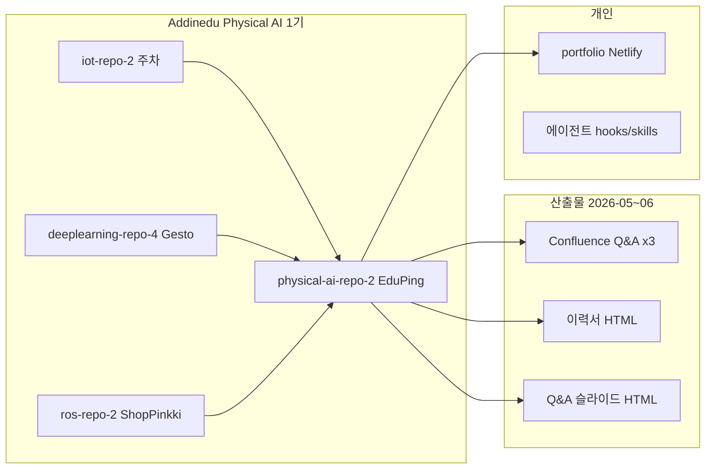

# 이정우 (Joey Lee) — 전체 프로젝트 작업 정리

**작성일:** 2026-06-09  
**작성 근거:** 로컬 git 이력, Claude 메모리(`~/.claude/projects/.../memory/`), Desktop Q&A·발표 산출물, 최근 개발 세션  
**Confluence:** Atlassian MCP가 타임아웃되어 **직접 페이지 fetch는 실패**. 아래 Confluence 섹션은 2026-06-02에 게시·동기화된 메모리·로컬 HTML 초안을 기준으로 정리함. 원문은 링크로 확인.

---

## 한 줄 요약

게임·3D 배경에서 **Physical AI / 로봇 SW**로 전환한 Addinedu 1기 수료생. 부트캠프 4팀 프로젝트(IoT 주차, Gesto 제스처, ShopPinkki 자율 카트, EduPing 최종)를 거쳐 **EduPing(등원 하이파이브·무궁화·포털)** UI·로봇 제어를 맡았고, **인터랙티브 Three.js 포트폴리오**와 **Confluence Q&A 3편**·이력서·발표 덱까지 정리했다.

| 구분 | 핵심 |
|------|------|
| 정체성 | B.S. Games (Utah) → Physical AI SW · 로봇 시각화·제어 |
| 최종 팀 프로젝트 | `physical-ai-repo-2` — EduPing / pingdergarten |
| 공개 포트폴리오 | [joeyjeongwooleeportfolio.netlify.app](https://joeyjeongwooleeportfolio.netlify.app) (`~/portfolio`) |
| Confluence (FN 스페이스) | 등/하원 · 무궁화 · 일과 보고서 Q&A 3페이지 (2026-06-02 게시) |
| Git 계정 | jwlee8403 / joey114132 |

---

## Confluence에서 한 일

**사이트:** [woolimi.atlassian.net](https://woolimi.atlassian.net)  
**스페이스:** FN (`cloudId: f13604c8-8efd-4cc7-b847-1879b2c85405`)  
**시리즈:** `Q&A` 부모 페이지(70746139) 아래 **「기능 - 이름」** 형식 (박우림 템플릿 스타일: 번호 섹션, 사용한 스택, ℹ️ 용어 패널, 표)

### 게시한 페이지 (이정우)

| 제목 | Page ID | 링크 | 내용 요약 |
|------|---------|------|-----------|
| 등/하원 - 이정우 | 70582337 | [wiki](https://woolimi.atlassian.net/wiki/spaces/FN/pages/70582337) | D435 뎁스 뷰, MediaPipe 손 추적, TRAC-IK closed-loop 하이파이브, MuJoCo 트윈, DCP-RMP. 🔴=손 palm / 🔵=그리퍼 palm 수렴 로직 |
| 무궁화 꽃이 피었습니다 - 이정우 | 70385701 | [wiki](https://woolimi.atlassian.net/wiki/spaces/FN/pages/70385701) | SR-PLAY-004 무궁화 게임 셸·박자·율동 녹화·게임 플로우 (발표/Q&A용 전체 서술) |
| 일과 보고서 (포털) - 이정우 | 72122385 | [wiki](https://woolimi.atlassian.net/wiki/spaces/FN/pages/72122385) | 부모 포털 타임라인·일정, Teleport 라이트박스, inline PATCH, dual-parsing, emotion capture |

### 퍼블리싱 방식 (교훈)

- Prismic CDN 이미지는 Confluence **`contentFormat: adf`** + `mediaSingle` external URL로 넣어야 렌더됨. HTML ``만 쓰면 migration placeholder로 깨짐.
- 로컬 초안: `~/Desktop/qna_*.html`, `~/Desktop/deck_share/qna_*.html` (가로 슬라이드 덱 형식, ①기술 / ②극복 / ③자랑 + 접이식 Q&A)

### Confluence 확인 상태 (2026-06-09)

| 항목 | 결과 |
|------|------|
| MCP `getConfluencePage` / `search` | **타임아웃** — 라이브 본문 재검증 불가 |
| Page ID·제목·게시일 | 메모리 + 로컬 HTML과 **일치** |
| 권장 후속 | 브라우저에서 위 3 URL 열어 최종본과 이 문서 diff |

---

## 프로젝트별 상세

### 1. EduPing / physical-ai-repo-2 (최종 · pingdergarten)

**경로:** `~/Desktop/physical-ai-repo-2/physical-ai-repo-2`  
**역할:** EduPing **웹 UI + OpenArm 제어 + MuJoCo 트윈 + 포털(부모)** — git 기준 이정우 커밋 64+ (`joey` / `jwlee8403`)

#### 내가 만든 UI·프론트 (git 검증)

| 영역 | 주요 파일·기능 |
|------|----------------|
| 등원 하이파이브 | `DepthViewer.vue`, `useHandTracker.ts`, `highfiveHandTarget.ts`, `useDepthStream.ts`(WS+zstd+Worker), `useDepthCloudInScene.ts`, `HighfiveDetector.vue` |
| 3D 로봇 뷰어 | `OpenarmViewer.vue` (three.js + URDF, .dae→.glb) |
| 무궁화 게임 | `MugunghwaGame.vue`, `MugunghwaArmManager.vue`, `RecorderControls.vue` |
| 등하원 출결 UI | `AttendanceCamera.vue` (서버 폴링·인사 모션 트리거) |
| OX 퀴즈 | `OXQuiz.vue`, `OXVisionPreview.vue` |
| 감정 캡처 | `useEmotionCapture.ts` (face-api.js) |
| Admin | `AdminOpenArmEmbed/Compare.vue`, 관절 한계·녹화 비교 |
| 포털 | `Report.vue`, `Schedule.vue`, 교사 `Dashboard/Reports.vue` |

#### 로봇·백엔드 (eduarm 범위)

| 영역 | 주요 파일·기능 |
|------|----------------|
| 하이파이브 제어 | `highfive_node.py` — TRAC-IK, **closed-loop IK→FK→residual** (정적 offset 제거) |
| MuJoCo 트윈 | `mujoco_twin_node.py` — 브라우저 depth 뷰를 진실 소스로 동기화 |
| 뎁스 스트리밍 | `d435_depth_streamer.py` — **시스템 `/usr/bin/python3`** 필수 (conda cv_bridge ABI 이슈) |
| D435 자동시작 | systemd placeholder + `install.sh` 자동 감지 |

#### 하이파이브 알고리즘 하이라이트

1. IK 목표 = 손(🔴)에서 어깨 방향 14cm 당김 → link7 IK (j6/j7 오버라이드)
2. FK로 그리퍼 palm(🔵) 계산 → residual만큼 목표 수정 (최대 5회)
3. 4-phase 제스처: raise → tap → rebound → home (rebound는 IK pull-back, lerp 실패 이력 있음)
4. LEFT arm: RIGHT 그룹 mirror-solve (TRAC-IK 한계)
5. MoveIt FK vs MuJoCo 렌더 ~10cm Z mismatch → `TAP_OVERSHOOT_*` 보정 (근본은 URDF/MJCF 정합)

#### 팀 경계 (문서·이력용)

- **본인 제외:** 박우림 — 호출어/STT/TTS, face track, 무궁화 perception/SAD/ByteTrack; 이강택 — nav/BT; tonyno — gogoping; 최민성 — 가게놀이
- **발표/Q&A 예외:** 무궁화 Confluence·`qna_mugunghwa.html`은 사용자 지시로 **전체를 이정우 작업으로 서술** (git 사실과 별도)

#### 최근 git (joey, 발표·Q&A)

```
1ac32a0 Q&A 슬라이드 불릿 정리
0e43911 Q&A 가독성·2단 이미지 줌
21fb8b3 등/하원·무궁화·일과보고서 가로 슬라이드 + 포털 타일
0734f96 final-v3 Q&A 보고서
36636a1 Joey/eduping highfive (#77)
4b98dc6 D435 스트리밍 + 하이파이브 탭
8c57dd1 무궁화 게임 + 율동 등록 UI
c0cdd62 포털 parent timeline report
```

---

### 2. Interactive Portfolio (`~/portfolio`)

**배포:** Netlify — Physical AI 인터랙티브 포트폴리오  
**구조:** WASD 미로 → 4개 프로젝트 스테이션 → 상세 Three.js 뷰어 · EN/KO `i18n.js`

#### 완료된 작업 (main 브랜치 git)

- 초기 배포, 모바일 미로 UX(조이스틱·햄버거), 한국어 README
- 반응형 미로 UI, 진행 저장, 부트 로더·브랜드 라벨
- 출구 패널 자기소개·시니어 UX, sprint SVG/favicon 수정
- 소개 히어로 스테이션 칩·애니메이션, PAI 덱 URL 갱신

#### 진행 중 (worktree `~/portfolio/.worktrees/review`, branch `work/portfolio-review`, **미커밋**)

| 파일 | 변경 요약 |
|------|-----------|
| `js/app.js` | `syncViewportMetrics()` — 뷰포트 CSS 변수·UI 스케일 |
| `css/style.css` | 반응형 타이포·spacing·ultrawide/short-height 대응 |
| `js/maze-scene.js` / `js/detail-scene.js` | rAF 일시정지, AA `perf-high`만, 중복 resize 제거 |
| `js/perf.js` | 터치 기기 대부분 `perf-low` |
| `js/i18n.js` | 인트로 eyebrow 제거, journey 톤 완화 |
| 에디터 rules/change-summary.mdc | 작업 종료 시 변경 목록 규칙 |

**로컬 검증:** `npm run verify:ui` (Playwright KO+layout) 통과, `http://127.0.0.1:8766`

---

### 3. ShopPinkki / ros-repo-2 (자율주행 쇼핑 카트)

**경로:** `~/ros-repo-2`  
**역할:** **owner-tracking 엔진** — YOLOv8 + ReID + IoU, Safe-ID lock, NCNN/MobileNetV3 ReID 개선, 지연·안정성 튜닝

#### 대표 커밋 (joey)

```
8a681d5 ByteTrack + ReID 0.25→1.0
4c396b9 tracking latency & motion stability
2eaca7f NCNN model, doll tracking
74bbf1f YOLO fixes
d3255ee LCD & QR rearrangement
```

---

### 4. Gesto / deeplearning-repo-4 (LSTM 제스처)

**경로:** `~/Desktop/deeplearning-repo-4`  
**역할:** **PyQt6 UI 전체** (~1,600 lines), MediaPipe+LSTM 파이프라인, 100+ 제스처 시퀀스, 게임 시뮬레이션·SFX·GUI

#### 대표 커밋 (joey)

```
ce37706 main GUI accomplished
e02a23d PPT ghost mode
8c34988 GUI + SFX
2bd9649 gesture log 제거, 카메라 뷰 최적화
0a1b8ec Linux 호환 (mac 전용 deps 제거)
```

---

### 5. 스마트 자동 주차 / iot-repo-2 (IoT)

**경로:** `~/Desktop/second_project/iot-repo-2` (클론)  
**역할:** ESP32 주차 안내 펌웨어, 다중 ESP32-CAM 스트리밍, **33-byte 바이너리 패킷** TCP/UDP/WS 프로토콜

- 이력서·발표 썸네일: 실제 3D프린트 로타리 타워 하드웨어 사진 (`피지컬AI1기_2팀_오주의 마법사.pptx`에서 추출)
- git author 필터로 joey 커밋은 로컬 클론에서 비어 있음 → 팀 제출·펌웨어 작업은 덱·이력서 기준

---

### 6. 이력서·발표·에셋 (Desktop)

| 산출물 | 경로 | 설명 |
|--------|------|------|
| 통합 이력서 | `~/Desktop/이력서_Resume_이정우.html` | KR/EN 토글, PDF, 4프로젝트 카드, 스크롤 스파이 |
| Q&A HTML 3종 | `~/Desktop/qna_*.html` | 등/하원, 무궁화, 포털 |
| 공유 덱 | `~/Desktop/deck_share/` | Q&A 가로 슬라이드 복사본 |
| 이미지 | `~/Desktop/eduping_draft_assets/`, `resume_assets/` | Prismic CDN 업로드·스크린캐스트 프레임 |
| 데모 영상 | `~/Videos/Screencasts/` | highfive_sim, highfive_edupingUI, OXQuiz 등 |

---

### 7. 에이전트 하네스 (2026-06-08~09)

개인 개발 환경 정리 (코드 프로덕트가 아닌 **워크플로**).

| 항목 | 위치 | 내용 |
|------|------|------|
| skill-activation-prompt | 로컬 hooks/ | 프롬프트마다 `skill-rules.json` 매칭 → 스킬 제안 |
| post-tool-use-tracker | 로컬 hooks/ | Write/StrReplace 후 편집 파일·build/tsc 캐시 |
| skill-rules.json | 로컬 skills/ | skill-developer, vercel-react-best-practices, web-design-guidelines |
| devlog 스킬 | `~/devlogs/` | 한국어 개발일지 라우터 (`devlog-ko*`) |
| Claude Code 동기화 | `~/.claude/settings.json` | UserPromptSubmit + PostToolUse 동일 훅 |

참고: [Velog — Claude Code 에이전트 팀 리팩토링](https://velog.io/@jaeminals/Claude-Code-%EC%97%90%EC%9D%B4%EC%A0%84%ED%8A%B8-%ED%8C%80%EC%9C%BC%EB%A1%9C-%EB%A6%AC%ED%8C%A9%ED%86%A0%EB%A7%81-%ED%95%B4%EB%B3%B4%EA%B8%B0)

---

## 타임라인 (요약)



---

## 검증·미완료

| 항목 | 상태 |
|------|------|
| Confluence 3페이지 라이브 본문 | **미검증** (API 타임아웃) |
| Portfolio worktree perf/responsive | **로컬 verify:ui 통과**, **미커밋** |
| Portfolio live Netlify | main 브랜치 기준 배포됨; worktree 변경은 **미배포** |
| physical-ai 발표 Q&A | repo 커밋됨 |

---

## 빠른 링크

- Portfolio live: https://joeyjeongwooleeportfolio.netlify.app
- GitHub: https://github.com/jwlee8403
- Confluence 등/하원: https://woolimi.atlassian.net/wiki/spaces/FN/pages/70582337
- Confluence 무궁화: https://woolimi.atlassian.net/wiki/spaces/FN/pages/70385701
- Confluence 포털: https://woolimi.atlassian.net/wiki/spaces/FN/pages/72122385

---

*이 문서는 `~/devlogs/2026-06-09/all-projects-work-summary.md` 에 저장됨. Confluence가 다시 연결되면 3개 페이지 본문과 diff 해서 갱신하는 것을 권장.*
